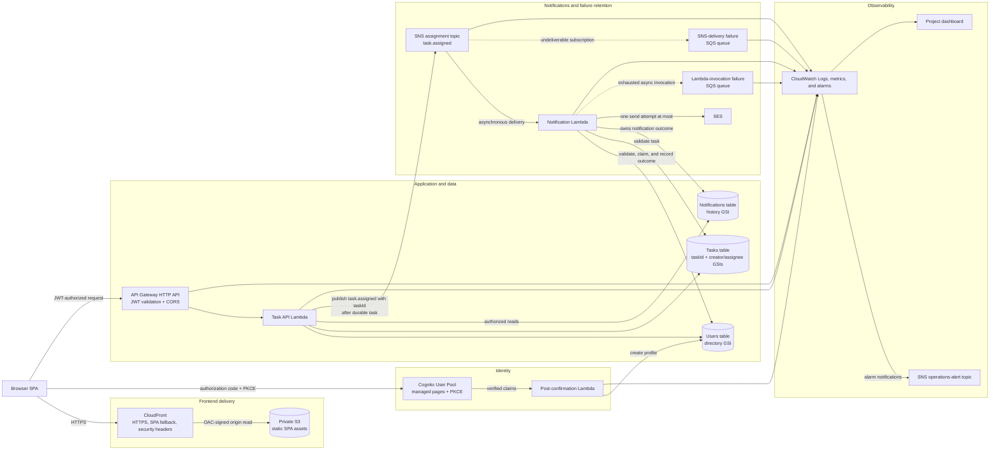

# Approved Architecture

**Owner:** Chris  
**Implementation due:** Week 1  
**GitHub issue:** `E1-I04`  
**Status:** Architecture baseline for review

## Purpose

This is the team's approved plan for the S3NT MVP. It puts
the master plan, backend, frontend, and AWS access specifications in one place
so everyone can see how the pieces fit together.

## Diagram

This is the approved target architecture. SNS, SQS failure queues, SES send,
alarms, and SAM CloudFront (`s3nt-web`) are not in the live `s3nt-app` stack
yet. Direct arrows show the expected
request or service-invocation path; dotted arrows show failure retention. The
`taskId` is created by the client, stored with the Task, and included in the
`task.assigned` event so the Notification Lambda can record one outcome for
that same task.

## Component responsibilities

| Component | What it does |
| --- | --- |
| CloudFront and private S3 | CloudFront is the public HTTPS entry point. The private S3 REST origin stores `index.html`, runtime `config.js`, and hashed frontend assets. The bucket policy allows reads only through the distribution's OAC path. |
| Cognito User Pool | Handles registration, verification, managed sign-in/recovery/sign-out, and the authorization-code flow with PKCE. The browser uses a public client, so it never stores a client secret. |
| Post-confirmation Lambda | Creates the application User profile from verified Cognito claims. It is safe if Cognito sends the trigger more than once. |
| API Gateway HTTP API | Checks JWT issuer, audience, and scope; handles CORS preflight; and sends valid requests to the Task API Lambda. |
| Task API Lambda | Handles profiles, the assignee directory, tasks, authorization, pagination, task idempotency, and publishing `task.assigned` events. |
| DynamoDB tables | Users stores profiles, email destinations, preferences, and the directory index. Tasks stores durable task state, creator/assignee indexes, and publication state. Notifications stores one notification claim/outcome for each `taskId` and terminal history. |
| SNS assignment topic | Separates durable task creation from notification work by passing versioned assignment events to the Notification Lambda. |
| Notification Lambda and SES | The Lambda checks the event, claims the notification, checks preferences, and records `sent`, `skipped`, `failed`, or `unknown`. It makes at most one SES send request for an assignment. |
| SQS failure queues | Keep two kinds of failures for operators to investigate: SNS messages that cannot reach their subscription and exhausted Notification Lambda invocations. Neither queue is part of the normal workflow or replays automatically. |
| CloudWatch and operations alerting | Provides structured logs, service metrics, alarms, a project dashboard, and alert notifications. |

## Normal assignment flow

1. The browser loads the SPA through CloudFront, signs in through Cognito, and
   sends a JWT-authorized request to API Gateway.
2. The Task API Lambda checks the caller and assignee, then conditionally saves
   the task using the client-provided `taskId`. The task must be stored before
   notification work begins.
3. The Task API Lambda publishes a versioned `task.assigned` event to SNS and
   records the publication state. A retry uses the same caller and unchanged
   payload.
4. SNS invokes the Notification Lambda asynchronously. The Lambda checks the
   Task and User, claims the notification record, and checks the recipient's
   notification preference.
5. If email is enabled, the Lambda records the SES-attempt boundary, makes one
   send request at most, and saves the final outcome. If the outcome is unclear
   after the send request, it records `unknown` instead of risking a duplicate
   email.
6. Users see authorized task and notification results through the Task API. The
   browser does not connect directly to DynamoDB, SNS, SQS, SES, or Lambda.

## Failure boundaries

- If publication or notification delivery fails, the task still exists.
  Notification failure never deletes, rolls back, or invalidates a task.
- SNS delivery failures go only to the SNS-delivery failure queue. Exhausted
  Notification Lambda invocations go only to the Lambda-invocation failure
  queue. We keep them separate because they contain different evidence and need
  different recovery decisions.
- `failed`, `skipped`, and `unknown` are final notification outcomes. We do not
  retry automatically after an uncertain SES result because that could send a
  duplicate email.
- Operators use the runbook to investigate retained records. They can perform a
  controlled replay only after validating it; neither failure queue has an
  automatic consumer.

## Trust boundaries

- **Internet to frontend:** CloudFront is the only public static-content path.
  Direct public S3 access is blocked, and OAC signs CloudFront-to-S3 requests.
- **Browser to identity and API:** Cognito handles identity and API Gateway
  checks JWTs. CORS allows only the exact local and deployed origins. The UI
  never decides whether a user is authorized.
- **API to application data:** Each Lambda role gets only the tables, indexes,
  topic, queues, and logs it needs. Backend use cases check whether the caller
  is the task creator or assignee before returning or changing data.
- **Event and email path:** The Task API is the normal publisher to the
  assignment topic. The Notification Lambda accepts events only from that topic
  and is the only component allowed to make the approved SES request.
- **Operations path:** Team members use temporary, least-privilege roles. The
  shared environment deploys reviewed commits through SAM/CloudFormation change
  sets; console code edits and `sam sync` are not allowed.

## Deployment passes

CloudFront's final domain is needed for Cognito callback/sign-out URLs and API
CORS. At the same time, the frontend needs API and Cognito outputs. We avoid
that circular dependency with this controlled two-pass deployment:

1. Check the account, Region, SES state, allowances, and capacity. Bootstrap
   the deployment identity, boundary, CloudFormation role, and artifact bucket.
2. Deploy tables and indexes, assignment and operations topics, both queues and
   their policies, and log groups.
3. Deploy execution roles, the three functions, resource permissions, SNS
   subscription/redrive settings, and the Notification Lambda async destination.
4. Deploy Cognito and the API using local callback, sign-out, and CORS values.
   Export the API and Cognito outputs for the frontend.
5. Deploy the private frontend bucket, OAC, CloudFront, cache behavior, SPA
   fallback, and response headers. Generate and upload `config.js`, immutable
   assets, and then `index.html`.
6. Update Cognito and API Gateway CORS with the exact CloudFront origin and
   callback/sign-out URLs. Verify SES sender/test recipients, deploy the alarms
   and dashboard, and run application, IAM, security, queue, and failure-path
   tests.

## Handoff

Attach the pull request, deployment/test evidence, and any remaining blocker to the owning GitHub issue.

## Definition of done

- The content matches the approved master, backend, and frontend contracts.
- Required reviewers have approved the change.
- Any referenced command or procedure has been exercised in the shared environment when applicable.
- Evidence contains no credentials, tokens, authorization codes, or unnecessary personal data.
